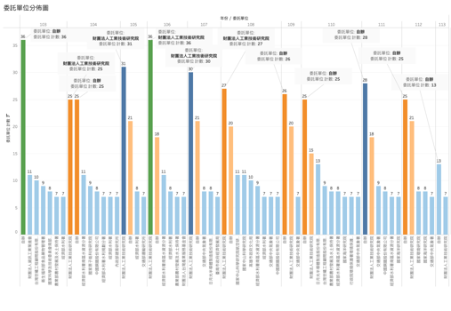
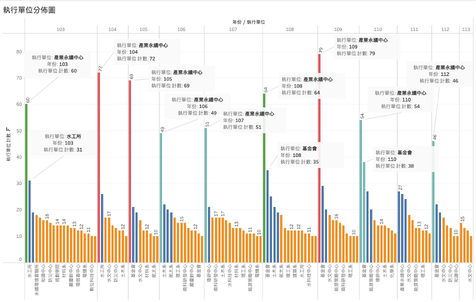
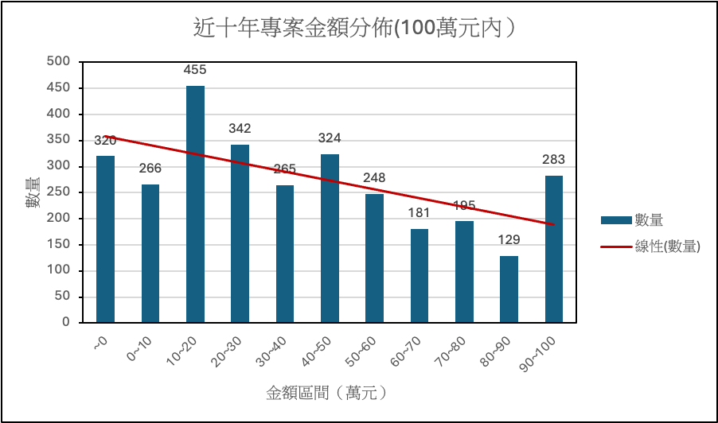
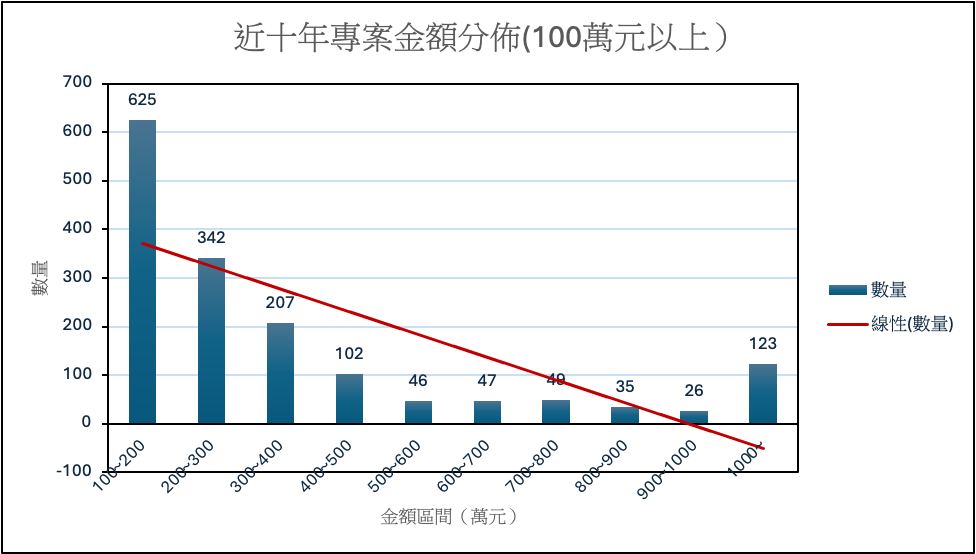
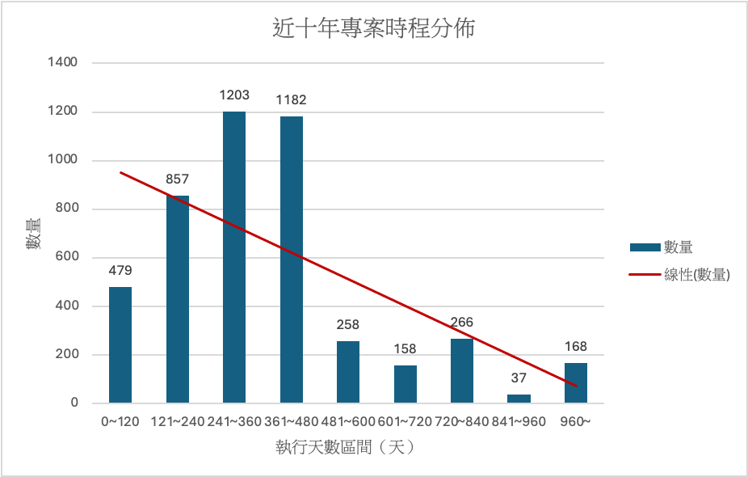

# Text-Analysis-NCKU-Research-and-Development-Foundation

## Content
- Abstract
- Data Clearify
- Data Analysis
- Category
- Word Spilt

# Abstract


本文旨在分析成功大學發展基金會 103 年度至 113 年度的 4610 個專案，透過高頻詞、所屬單位、分類類別來制式化命名未來的專案名稱，目的在完善資料庫管理並且預期達到預測未來專案發展趨勢的目標。主要分析方法是透過中研院的 CKIP Tagger， 先針對所有的專案名稱進行斷詞，而 4610 個專案經過斷詞後大致有 38867 個詞彙資料，經過資料清洗的流程後再進行後續的詞頻計算、分類等任務。 

關鍵字:斷詞、詞頻、詞彙分類


# Data Clearify
1. 專案數量
>103 年度至 113 年度共有 4610 個專案，資料來源皆為成功大學發展基金會，並皆為真實資料。
2. 欄位名稱 
>分別為專案名稱、委託單位、執行單位、金額、執行期限起迄、類別、總管理費、性質、狀態。
3. 委託單位
>近十年專案的委託單位如下表所示，可以看到財團法人工業技術研究院是數量最多的，共有 279 件，其次是自辦的 265 件。


| 案數 | 委託單位 |
| :--: | :--: |
|279|財團法人工業技術研究院|
|265	|   自辦|
|70	|   經濟部水利署南區水資源分署|
|40~69|	交通部中央氣象署、日月光半導體製造股份有限公司、經濟部水利署、中國鋼鐵股份有限公司、交通部運輸研究所、農業部農村發展及水土保持署、台灣世曦工程顧問股份有限公司、國家科學及技術委員會南部科學園區管理局、財團法人台灣產業服務基金會、經濟部水利署水利規劃分署|
|30~39 |	國家原子能科技研究院、國家海洋研究院、文化部文化資產局、農業部農村發展及水土保持署臺南分署、環境部、行政院環境保護署環保人員訓練所|
|20~29	|財團法人金屬工業研究發展中心、財團法人中興工程顧問社、國家中山科學研究院航空研究所、高雄市政府文化局、財團法人資訊工業策進會、中聯資源股份有限公司、財團法人台灣綠色生產力基金會、內政部建築研究所、國家太空中心、律勝科技股份有限公司、台灣中油股份有限公司、國家中山科學研究院、業興環境科技股份有限公司、財團法人中衛發展中心|



4.	執行單位
>近十年專案的執行單位如下表所示，可以看到產業永續中心是數量最多的，共有586件，其次是基金會及水工所的218件。

|案數|執行單位|
| :--: | :--: |
|586	|產業永續中心|
|218	|基金會、水工所|
|164	|水文中心|
|120~139	|防災中心、能源策略中心|
|100~119	|環研中心、建築系|
|80~99	|環工系、南科研發中心、知識中心、航太系、材料系、都計系、嚴慶齡中心、水科技中心|
|60~79	|測量系、化學系、電機系|
|40~59	|公共工程中心、水利系、防火中心、機械系、建築評定中心、資訊所、大地資源中心、水質研究中心、航太中心、軌道中心、衛星中心、水保生態中心、永續環境實驗所、綠能電子研究中心|
|20~39	|能源中心、數位科技中心、前瞻醫材中心、氣候變遷中心、資源再生中心、客家中心、技轉育成中心、資源系、國土中心、化工系、製造所、環微毒中心、馬達中心、防災教育中心、工資管系、交管系、漁船中心、金融創新中心、永續能源中心、地科系|




5.	專案金額
>分析近十年專案的金額區間，以提供一個總覽來了解各專案的預算範圍和分佈情況。全部專案金額的平均值為1,741,750元，中位數為667,183元，標準差為3,686,304元，而在0元的數量最多，有320件，其次是10~20萬元的區間，有455件。



若在進一步分析100萬元以上的專案金額分佈，可以發現100~萬元區間的件數最多，共625件，其次是200~300萬元的區間，共342件。



6.	專案時程
分析近十年專案的執行天數，以提供一個總覽來了解各專案的執行天數範圍和分佈情況，進而可以分析天數對專案的影響。103年-113年專案的平均執行天數約為367天，中位數約為333天，標準差約為276天，而執行天數位在241~360天的專案數量最多，共有87件。



# Data Analysis
1.	斷詞
>得到原始資料後，先針對專案名稱進行斷詞。舉例來說，專案「提升氮化鋁薄板之機械強度與導熱係數之技術開發」將會斷成「提升、氮化鋁、薄板、機械、強度、導熱、係數、技術、開發」等詞彙資料。
2.	資料清洗
>首先清洗英文名稱的專案，接著除去stop words、無意義的數字與詞彙，得到一筆乾淨的詞彙資料。
3.	資料分類
>根據所有斷詞詞彙間做分析並分類，初步分成十個類別（產業、方法、研究資源類型、研究技術、服務、評估、環境生態、水文、檢測審查、地點與區域），後續結合關鍵字及相似度分析將所有的詞彙資料分類完成。
4.	重要資料詞頻
>計算各個分項（委託機構、執行單位、年份、詞彙類別）的詞頻。
5.	預測
>目的在找出年份間資料的規律，作為往後專案名稱命名根據，並找出專案計畫未來發展趨勢。

# Category

在專案斷詞後得出的所有詞彙中，經過ChatGPT來分出10個主要的分類類別，並列出該分類的關鍵字，經過彙整後，引入fuzzywuzzy的套件來選出與關鍵字最相似的字，藉此達成對所有詞彙資料的分類，最終分成10個類別。

1.	產業：
>近十年詞彙資料內分類為「產業」中共有2084案，本分類主要提供專案負責的企業或公司資訊，可以看出該專案是由什麼單位負責。
`關鍵字：公司、股份、有限公司、企業、實業、電廠、產業`
2.	研究方法：
>近十年詞彙資料內分類為「研究方法」中共有3457案，本分類主要提供專案使用的研究方法資訊，包括管理、分析、調查等等，可以藉由了解專案研究方法來看出未來研究方法的趨勢。
`關鍵字：分析、設計、工程、開發、工作、發展、處理、治理、計算、解析、研擬、管理`
3.	研究資源
>近十年詞彙資料內分類為「研究資源」中共有2343案，本分類主要提供專案使用的研究資源，包括設施、數據、資料等等，可以藉由了解專案資源來看出研究資料的來源。
`關鍵字： 設施、電源、研究、數據、資安、資料、管理、設備、材料、課程`
4.	研究技術
>近十年詞彙資料內分類為「研究技術」中共有3732案，本分類主要提供專案使用的研究技術，包括掃描、光達等等特定技術。
`關鍵字：掃瞄、電子、醫療、技術、資訊、工程、區塊鏈、光達、衛星影像、空載、ISO、精密、金屬加工、模型、試驗、智慧生產`
5.	服務
>近十年詞彙資料內分類為「服務」中共有562案，本分類主要提供專案中有使用到的服務種類。
`關鍵字： 服務、勞務`
6.	評估
>近十年詞彙資料內分類為「評估」中共有744案，本分類主要提供專案使用的評估方法資訊。
`關鍵字：評估、評測、觀測、管控`
7.	環境生態
>近十年詞彙資料內分類為「環境生態」中共有1260案，本分類主要提供研究進行時的環境生態。
`關鍵字：環境、生物、生態、再生、循環、生質、環保、變遷` 
8.	水文	
>近十年詞彙資料內分類為「水文」中共有1712案，本分類主要提供專案中有提及的水文資訊。
`關鍵字：地下水、水庫、水質、水文、水力、水土、廢水、水、水足跡`
9.	檢測與審查
>近十年詞彙資料內分類為「檢測與審查」中共有1646案，本分類主要提供專案使用的檢測審查資訊，包括等等檢測、偵測、審查等等。
`關鍵字：審查、檢測、測試、盤查、監測、查證、預測、偵測、試驗` 
10.	地點與區域
>近十年詞彙資料內分類為「地點與區域」中共有1463案，本分類主要提供專案所在地點資訊，可以藉此了解近十年專案集中在哪些地區研究。
`關鍵字：縣市、 區、段、廠、路、台灣、公園、水庫`


# Word Spilt 
```Python
1.	data_utils.download_data_gdown( ./ )
2.	ws = WS( ./data )
3.	df = pd.read_csv( name_test.csv )
4.	sentence_list = df[ 名稱 ]
5.	word_sentence_list = ws(sentence_list)
6.	print(word_sentence_list)
7.	result_df = pd.DataFrame(columns=[ 名稱 ])
8.	for idx, word_sentence in enumerate(word_sentence_list):
9.	    if isinstance(word_sentence, list):
10.	        for i, word in enumerate(word_sentence):
11.	            col_name = f 斷詞結果_{i}   # 動態生成列名
12.	            if col_name not in result_df.columns:  # 如果列名還不存在，則創建這一列
13.	                result_df[col_name] =   
14.	            result_df.loc[idx, col_name] = word  # 將斷詞結果存入對應的列中
15.	        result_df.loc[idx,  名稱 ] = sentence_list[idx]  # 放入原始資料到”名稱”欄位
16.	print(result_df)
```